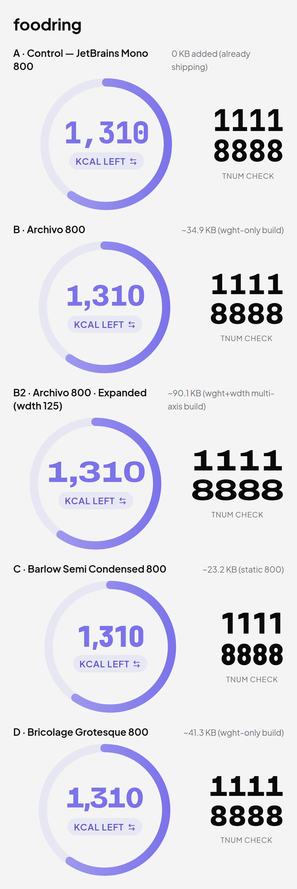
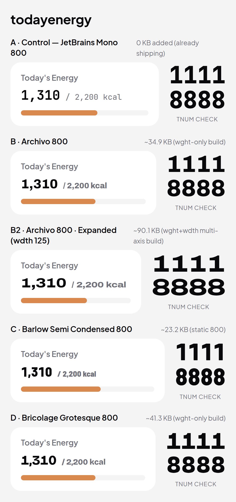
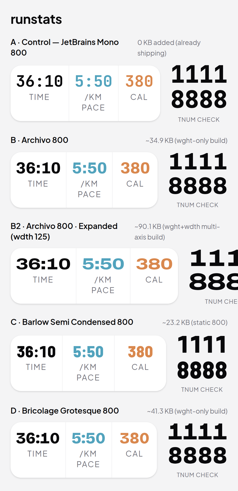
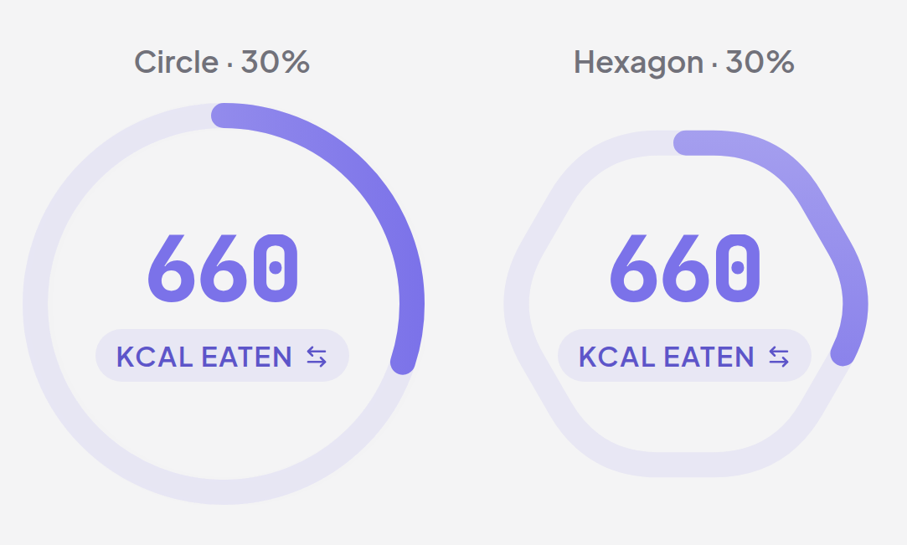
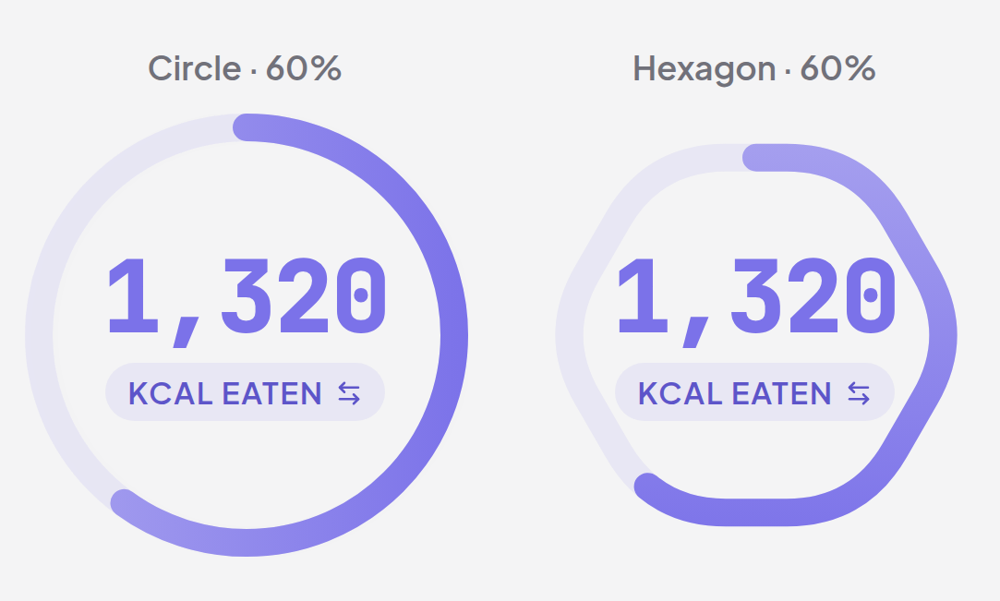
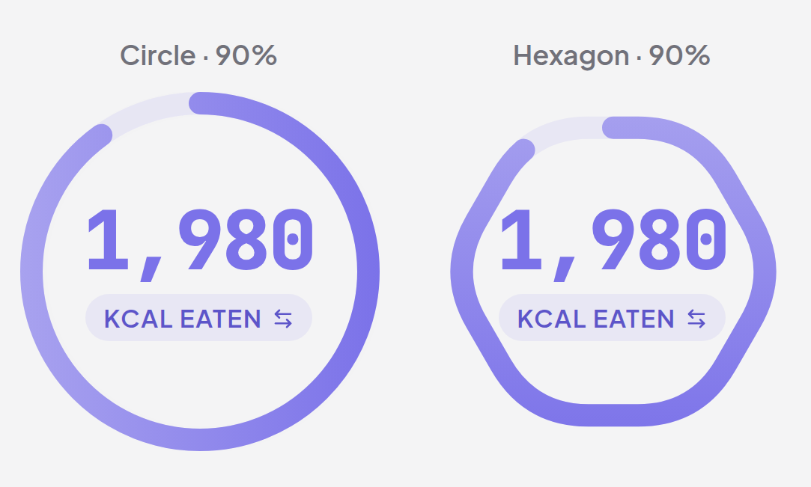
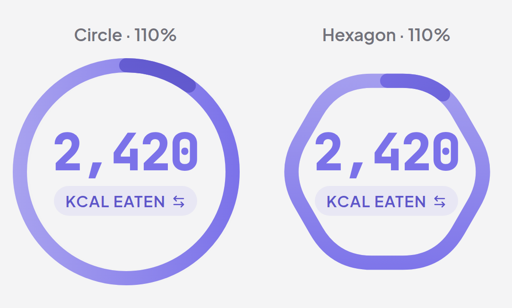
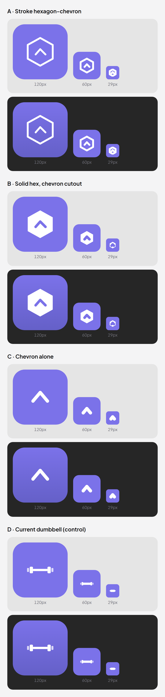

# Brand refresh bake-off — contact sheet

Comparison candidates for three deferred brand-refresh decisions, rendered on
real app surfaces via the Playwright rig (393px, @3x, light + dark, animations
disabled). **Nothing here ships.** Candidates live behind the dev/test-only
`/dev/brand-bakeoff` route, which — along with all candidate fonts — is
stripped from the production build (`import.meta.env.MODE` gate in `App.tsx`;
verified: prod `dist/` contains no `BrandBakeoff` chunk and no Archivo/Barlow/
Bricolage woff2). The only production-committed artifact is one canonical
hexagon-chevron SVG (`src/assets/brand/hexagon-chevron.svg`), not yet wired to
any surface.

**This sheet contains no recommendation — the choice is human.**

How to view live: `npm run build:e2e && npm run preview`, sign in, visit
`/dev/brand-bakeoff` (the three tabs: fonts / ring / icon).

---

## Experiment 1 — hero-numeral typeface

Scope: the **display-numeral tier only** (the big hero stat numbers). Body
text, labels, and all working numerals stay Plus Jakarta Sans + JetBrains Mono
regardless of outcome. Candidate set reconciled with the POST_LAUNCH.md table
(Geist skipped per its note — reads tech-brand).

### Tabular-figure check (HARD requirement)

Hero numbers animate (count-ups); proportional digits cause width jitter. Each
candidate rendered `1111` over `8888` at hero size with `tnum` forced;
measured digit-string widths must match.

| Variant                              | `1111` width | `8888` width | tabular |
| ------------------------------------ | ------------ | ------------ | ------- |
| A · JetBrains Mono 800 (control)     | 86.41px      | 86.41px      | ✅ PASS |
| B · Archivo 800                      | 90.30px      | 90.30px      | ✅ PASS |
| B2 · Archivo 800 Expanded (wdth 125) | 112.61px     | 112.61px     | ✅ PASS |
| C · Barlow Semi Condensed 800        | 77.05px      | 77.05px      | ✅ PASS |
| D · Bricolage Grotesque 800          | 90.58px      | 90.58px      | ✅ PASS |

All five hold tabular width — none disqualified. (The `tnum check` block also
appears on every surface sheet below for visual confirmation.)

### Candidate notes

| Variant                                  | woff2 that would ship (latin)                   | Licence                                            | Notes                                                                                                                                                                                                                                                      |
| ---------------------------------------- | ----------------------------------------------- | -------------------------------------------------- | ---------------------------------------------------------------------------------------------------------------------------------------------------------------------------------------------------------------------------------------------------------- |
| **A · JetBrains Mono 800**               | 0 KB added (already shipping)                   | —                                                  | Current. Monospace; even, technical, slightly "code-editor".                                                                                                                                                                                               |
| **B · Archivo 800**                      | ~34.9 KB (wght-only build)                      | OFL (via fontsource)                               | Clean grotesque; tighter, more contemporary than the control.                                                                                                                                                                                              |
| **B2 · Archivo 800 Expanded (wdth 125)** | ~90.1 KB (needs the wght+wdth multi-axis build) | OFL                                                | Same family, widened — athletic/jersey energy. Costs the multi-axis woff2.                                                                                                                                                                                 |
| **C · Barlow Semi Condensed 800**        | ~23.2 KB (static 800)                           | OFL                                                | Condensed scoreboard heritage; narrowest, smallest bundle.                                                                                                                                                                                                 |
| **D · Bricolage Grotesque 800**          | ~41.3 KB (wght-only build)                      | OFL                                                | Characterful, distinctive digit shapes; most "designed".                                                                                                                                                                                                   |
| **E · Satoshi 800**                      | —                                               | Fontshare ITF Free License (permits app embedding) | **DROPPED, not evaluated.** Licensing is fine, but Satoshi is not a clean npm/fontsource package — the woff2 must be self-hosted manually, and this sandbox's network policy blocks the Fontshare download. Re-add manually when the asset can be fetched. |

### Surface 1 — Food hero ring number + KCAL pill (real `CalorieRing`)

The marquee surface — the live `CalorieRing` component with each candidate
font applied to its numeral. "1,310" = KCAL LEFT.

| Light                        | Dark                        |
| ---------------------------- | --------------------------- |
|  |  |

### Surface 2 — Today's Energy intake row

Faithful reconstruction (same classes / sizes / colours / values as the live
Home surface). "1,310 / 2,200 kcal".

| Light                           | Dark                           |
| ------------------------------- | ------------------------------ |
|  |  |

### Surface 3 — RunDetail stat cards

Faithful reconstruction of the live RunDetail stat row (36:10 / 5:50 / 380).

| Light                        | Dark                        |
| ---------------------------- | --------------------------- |
|  |  |

---

## Experiment 2 — hexagon vs circle calorie ring

`HexCalorieRing` is a drop-in alternative to `CalorieRing`: a rounded
(squircle) flat-bottom hexagon whose perimeter the progress stroke sweeps via
`pathLength=100` + dasharray, starting top-centre and going clockwise like the
circle. Everything else is preserved — purple gradient stroke, track underlay,
centre content (number + mode pill + glance line), the no-red-over-target
rule, the over-100% overshoot arc, dark-mode treatment, and the `glowing`
celebration hook. Scope is the **calorie ring only**; macro/performance rings
are untouched.

Rendered on the real ring components, circle vs hexagon, at four progress
levels (intake mocked to hit each). The **30% sheet is the legibility test** —
partial progress on the hexagon must read as instantly as on the circle.

| Level            | Light                   | Dark                   |
| ---------------- | ----------------------- | ---------------------- |
| 30% (legibility) |   |   |
| 60%              |   |   |
| 90%              |   |   |
| 110% (overshoot) |  |  |

Notes:

- Geometry parity holds: gradient, recessed track, centre number/pill, and the
  deeper overshoot arc all render on the hexagon path identically to the
  circle. 30% partial progress reads cleanly.
- Rendering quirk: a flat-top hexagon is wider than tall, so at the same
  bounding box the hexagon's interior is a touch shorter vertically than the
  circle's — the centre content sits with slightly less vertical breathing
  room. Corner squircle radius is ~0.35 × side length (not sharp).

---

## Experiment 3 — app icon

The current `ios/.../AppIcon-512@2x.png` is placeholder template art (visible
gridlines) — a real icon is required pre-submission. All candidates derive
from the canonical hexagon-chevron geometry now committed at
`src/assets/brand/hexagon-chevron.svg` (consistent with the in-app EmptyState
hexagon). Solid brand-purple field (`#7B72E9`), white mark, ~20% padding; the
dark-wallpaper row's 120px tile shows the restrained two-stop vertical
gradient variant.

Rendered at the home-screen-critical sizes that fit a phone-width sheet: 120px
(home @3x shape), 60px (spotlight/settings), 29px (notifications — the
legibility floor). 1024/180px aren't shown at actual size (not viewable in a
393px sheet); shape is judged at 120, legibility at 60/29.

| Light wallpaper + Dark wallpaper (incl. gradient @120) |
| ------------------------------------------------------ |
|                               |
|                                |

Legibility thresholds observed on the sheet:

- **A · Stroke hexagon-chevron** — reads at 120 and 60; at **29px the thin
  hexagon stroke muddies and the chevron is hard to separate from the
  outline.** Loses the chevron read below ~40px.
- **B · Solid hex, chevron cutout** — reads at 120/60; the chevron cutout is
  still legible at 29px but tight. Holds the brand mark smallest of the
  hexagon options.
- **C · Chevron alone** — clearest at every size including 29px (no fine
  hexagon detail to lose). Trades brand-mark completeness for small-size
  clarity.
- **D · Current dumbbell (control)** — collapses to an indistinct
  bar/pill at 29px; off-brand vs the hexagon identity.

No asset-catalog changes were made; the winner gets wired in a later rollout.

---

## Cross-cutting

- Production safety verified: `npm run build` (mode "production") produces no
  bake-off chunk and no candidate-font woff2; existing fonts unchanged.
- DESIGN_GUIDE.md and all design tokens are untouched.
- The candidate fonts are devDependencies; they only enter the dev/test build's
  bake-off chunk.
