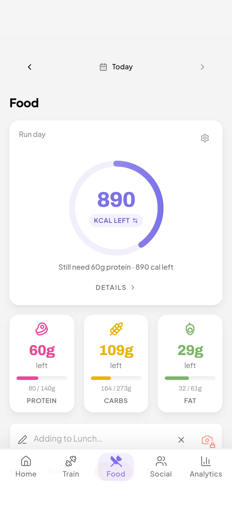
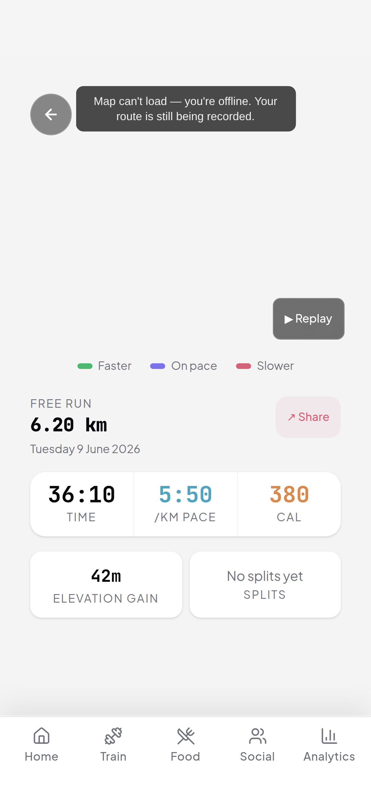
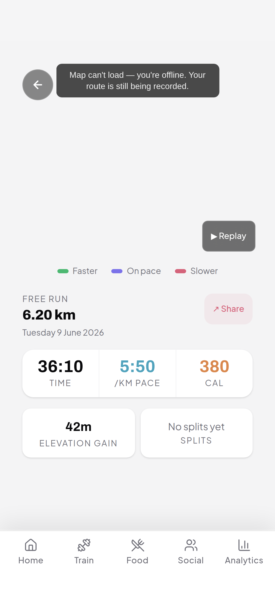
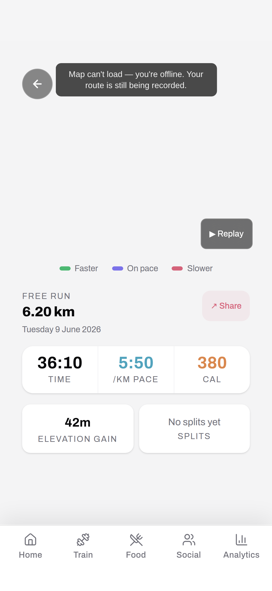
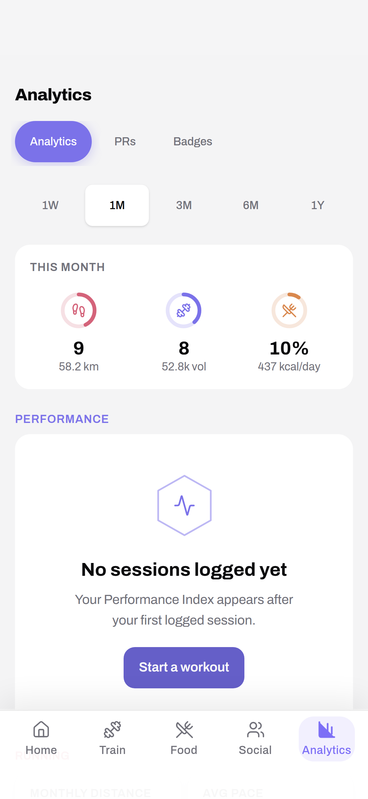
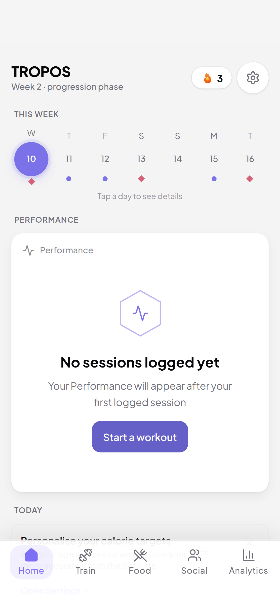
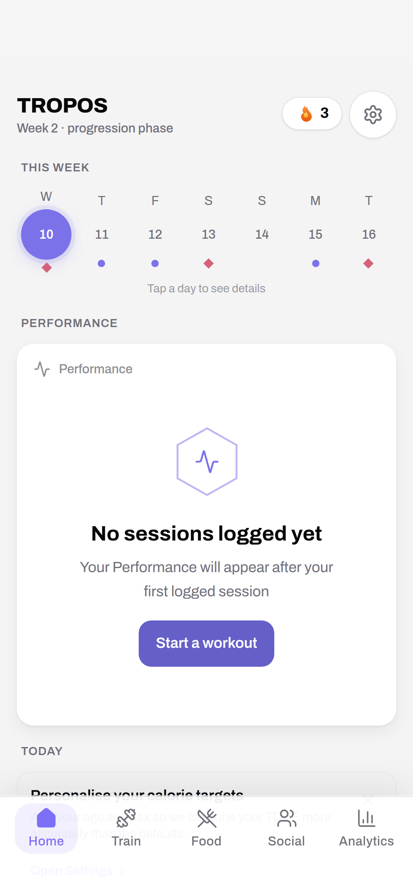

# Brand refresh — decisions

Follow-up to the bake-off. After the isolated-numeral sheets surfaced a real
problem (JetBrains Mono's **dotted zero** would clash with any second numeral
font used hero-only — a mismatched `0` on the same screen reads as a bug, not
hierarchy), I built whole-app font-combo mocks on the real screens and chose
from those. Harness: `src/dev/fontBakeoff.ts` (dev/test-only, MODE-gated,
stripped from production) overrides the numeral/display font tokens app-wide
from a `bk-font-combo` flag; captures in `fullscreen/`.

## The three combos mocked (real screens: Home / Food / History / RunDetail)

| Combo           | Text              | Numbers        | Fonts                 |
| --------------- | ----------------- | -------------- | --------------------- |
| **control**     | Plus Jakarta Sans | JetBrains Mono | 2 (current)           |
| **archivo-num** | Plus Jakarta Sans | **Archivo**    | 2 (mono→Archivo swap) |
| **archivo-all** | Archivo           | Archivo        | 1 (single family)     |

What the mocks showed:

- **control** — internally consistent, but the mono numerals read "code-editor
  / instrument," which sits slightly off the warm, consumer brand. Dotted zeros.
- **archivo-num** — numbers gain a confident, editorial-sport character; plain
  zeros; **all numbers are one font so there is no clash** (the hero-only
  problem only existed because mono stayed for data). Plus Jakarta Sans keeps
  the warm text voice. Contrast worry (Archivo numbers vs Jakarta labels) did
  **not** materialise on the real screens — numbers read distinctly from labels
  by size/weight/colour. Columns align (tnum verified; RunDetail stat cards,
  History stats, Food tiles all clean).
- **archivo-all** — most cohesive, but drops Plus Jakarta Sans entirely; the
  text turns more neutral/grotesque and loses Jakarta's friendliness. It's a
  full text-system rebrand, not a numeral refresh.

## Decision 1 — hero / numeral typeface → **archivo-num**

**Plus Jakarta Sans (text) + Archivo (all numbers), replacing JetBrains Mono.**

Why:

- It's a clean **swap, not a third font** (stays a two-font system) and **not a
  rebrand** (text identity untouched) — lowest-risk path that still delivers the
  upgrade.
- Applying Archivo to **all** numbers (not hero-only) is what actually fixes the
  dotted-zero clash you spotted — one numeral identity, no mismatched `0`.
- Keeps Plus Jakarta Sans, so the established warm/friendly text voice (a
  deliberate brand choice) is preserved; only the numerals change.
- Archivo's grotesque digits give the stats real personality vs the generic
  fitness-app field, while `tnum` keeps them tabular for the count-up
  animations and column alignment.

Not archivo-all: the single-family cohesion is nice but it's a brand-voice
shift (loses Jakarta's warmth) far bigger than the numeral question asked, and
unnecessary to fix the clash. Park it for a future full identity refresh.
Not control: mono's "techy" read is the weakest part of the current type
system for a warm consumer app; archivo-num is the upgrade for ~35 KB.

Bundle: Archivo wght-only latin woff2 ~34.9 KB; JetBrains Mono is removed from
the numeral path (net roughly a wash). Licence: OFL (embed-safe via fontsource).

Rollout (separate task): point `--font-mono` at Archivo, drop the JetBrains
Mono import, and spot-check the densest tabular surfaces (set-log grid, splits
table) for alignment. Everything reads the token, so it's a near one-variable
swap.

## Decision 2 — calorie ring → **keep the circle**

The app's data-viz language is circular (calorie/macro/performance rings, day
bubbles, avatars). A circle is the better shape for a continuous progress
sweep (more instantly readable than a 6-cornered path), keeping it consistent
avoids one odd hexagon among many circles, and it preserves the hexagon's
scarcity. The hexagon ring is viable (`HexCalorieRing` works) but not better
for the system — do not ship it.

## Decision 3 — app icon → **candidate B (solid hexagon + chevron cutout)**

The icon is the right home for the hexagon (identity, not data). B is the only
hexagon option that holds the brand mark down to 29px (A's stroke muddies, C
drops the hexagon, D is the off-brand placeholder). Wire from the canonical
`src/assets/brand/hexagon-chevron.svg` in rollout.

## Principle this settles

**Circles carry Tropos's data; the hexagon signs its name** (icon + empty
states + badges). Numerals move to Archivo; text stays Plus Jakarta Sans.

## Evidence

Full-screen mocks (393px, light), per combo:

| Screen    | control                               | archivo-num                               | archivo-all                               |
| --------- | ------------------------------------- | ----------------------------------------- | ----------------------------------------- |
| Food      |       |       |       |
| RunDetail |  |  |  |
| History   |    |    |    |
| Home      |       |       |       |
